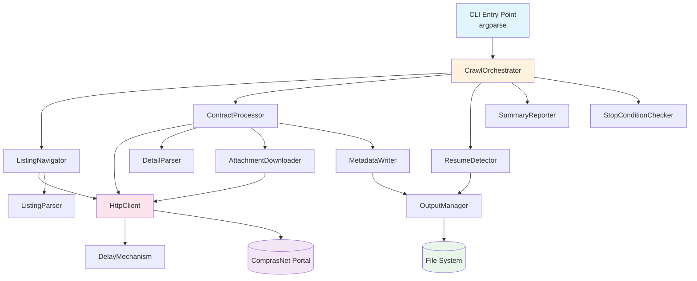
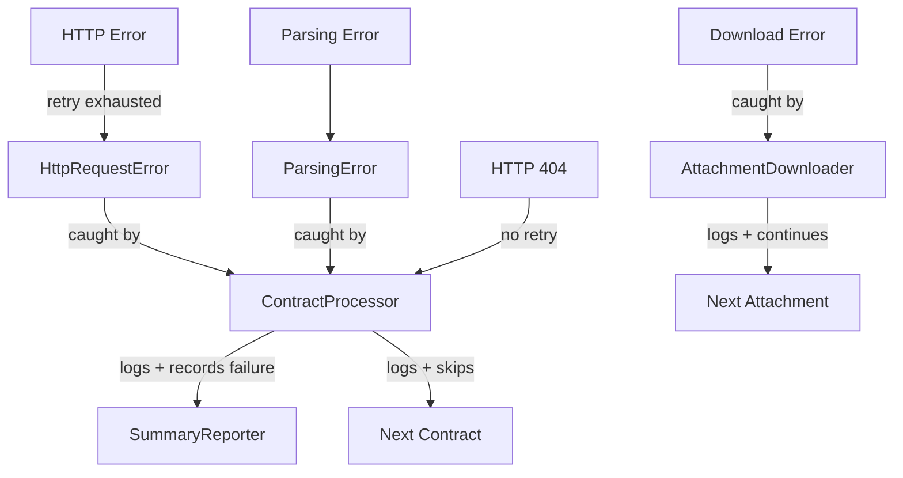

# Design Document

## Overview

GovDataCrawler is a Python command-line application that scrapes public contract data from the Brazilian government's ComprasNet transparency portal (`https://contratos.comprasnet.gov.br/transparencia/contratos`). The tool navigates paginated contract listings, extracts detailed contract information from individual contract pages, downloads attached files, and organizes all collected data into a hierarchical folder structure grouped by organization (Órgão), management unit (Unidade Gestora), and contract ID.

### Key Design Decisions

1. **Python with `requests` + `BeautifulSoup4`**: Chosen for simplicity and maturity in HTML scraping. The ComprasNet portal serves server-rendered HTML, so a headless browser is unnecessary.
2. **Single-threaded sequential processing**: Deliberate choice to respect the portal's resources and avoid triggering anti-bot protections. The delay mechanism between requests reinforces this.
3. **JSON metadata files**: Contract data is stored as JSON for easy programmatic consumption and human readability.
4. **Resumption via filesystem state**: Instead of maintaining a separate database or state file, the crawler detects already-processed contracts by checking for existing metadata files on disk. This keeps the tool stateless and simple.
5. **Structured logging with `logging` module**: Dual output to console and file using Python's built-in logging, avoiding external dependencies.

### Technology Stack

| Component | Technology | Rationale |
|---|---|---|
| Language | Python 3.10+ | Rich ecosystem for web scraping, widely available |
| HTTP Client | `requests` 2.32.x | Mature, session-based HTTP with retry support |
| HTML Parser | `beautifulsoup4` 4.12.x with `lxml` | Fast, reliable HTML parsing |
| CLI Interface | `argparse` (stdlib) | No external dependency needed for simple CLI |
| Logging | `logging` (stdlib) | Built-in dual handler support (console + file) |
| Testing | `pytest` 8.x + `hypothesis` 6.x | Industry-standard test runner with property-based testing |
| Retry Logic | `urllib3.util.retry` + `requests.adapters` | Built-in retry with exponential backoff via HTTPAdapter |

## Architecture

The application follows a layered architecture with clear separation between HTTP transport, HTML parsing, data persistence, and orchestration.



### Component Responsibilities

| Layer | Component | Responsibility |
|---|---|---|
| **Entry Point** | CLI | Parse command-line arguments, configure logging, launch orchestrator |
| **Orchestration** | CrawlOrchestrator | Coordinate the full crawl lifecycle: listing → filtering → processing → summary |
| **Navigation** | ListingNavigator | Paginate through contract listing pages, collect all contract IDs |
| **Navigation** | ListingParser | Extract contract IDs and next-page links from listing HTML |
| **Processing** | ContractProcessor | Process a single contract: fetch detail page, extract data, download attachments |
| **Processing** | DetailParser | Extract structured contract fields from detail page HTML |
| **Processing** | AttachmentDownloader | Download and save attachment files for a contract |
| **Persistence** | MetadataWriter | Serialize contract data to JSON and write to disk |
| **Persistence** | OutputManager | Manage output directory structure, sanitize folder names, check existence |
| **Infrastructure** | HttpClient | Send HTTP requests with session management, retry logic, and delay |
| **Infrastructure** | DelayMechanism | Generate random delays between configurable min/max bounds |
| **Resumption** | ResumeDetector | Scan output directory to identify already-processed contract IDs |
| **Control** | StopConditionChecker | Evaluate stopping criteria (max time, max contracts) during the crawl loop |
| **Reporting** | SummaryReporter | Track and report execution statistics |

## Components and Interfaces

### CLI Entry Point

```python
# gov_data_crawler/cli.py

def parse_args(argv: list[str] | None = None) -> argparse.Namespace:
    """Parse command-line arguments.

    Args:
        argv: Argument list (defaults to sys.argv[1:]).

    Returns:
        Parsed namespace with: output_dir, min_delay, max_delay, max_time, max_contracts, log_level.
    """

def setup_logging(output_dir: str, log_level: str) -> logging.Logger:
    """Configure dual logging to console and file.

    Args:
        output_dir: Directory for the log file.
        log_level: Logging level string (DEBUG, INFO, WARNING, ERROR).

    Returns:
        Configured root logger.
    """

def main(argv: list[str] | None = None) -> None:
    """Application entry point.

    Parses arguments, sets up logging, creates all components
    (including StopConditionChecker from --max-time and --max-contracts),
    and runs the CrawlOrchestrator.
    """
```

### CrawlOrchestrator

```python
# gov_data_crawler/orchestrator.py

class CrawlOrchestrator:
    """Coordinates the full crawl lifecycle."""

    def __init__(
        self,
        http_client: HttpClient,
        listing_navigator: ListingNavigator,
        contract_processor: ContractProcessor,
        resume_detector: ResumeDetector,
        summary_reporter: SummaryReporter,
        stop_condition_checker: StopConditionChecker,
        logger: logging.Logger,
    ) -> None: ...

    def run(self) -> CrawlSummary:
        """Execute the full crawl: list → filter → process (with stop checks) → summarize.

        The processing loop checks stop conditions after each contract.
        When a stop condition is met, the current contract is finished
        before the crawl ends.

        Returns:
            CrawlSummary with execution statistics.
        """
```

### ListingNavigator

```python
# gov_data_crawler/listing.py

class ListingParser:
    """Extracts contract IDs and pagination links from listing HTML."""

    def parse_contract_ids(self, html: str) -> list[str]:
        """Extract all contract IDs from a listing page.

        Args:
            html: Raw HTML of a contract listing page.

        Returns:
            List of contract ID strings found on the page.
        """

    def parse_next_page_url(self, html: str) -> str | None:
        """Extract the URL of the next listing page, if any.

        Args:
            html: Raw HTML of a contract listing page.

        Returns:
            Absolute URL of the next page, or None if this is the last page.
        """

class ListingNavigator:
    """Navigates all pages of the contract listing."""

    def __init__(
        self,
        http_client: HttpClient,
        parser: ListingParser,
        base_url: str,
        logger: logging.Logger,
    ) -> None: ...

    def collect_all_contract_ids(self) -> list[str]:
        """Navigate all listing pages and collect every contract ID.

        Returns:
            Complete list of contract IDs across all pages.
        """
```

### ContractProcessor

```python
# gov_data_crawler/contract.py

@dataclass
class ContractMetadata:
    """Structured representation of a contract's extracted data."""
    contract_id: str
    orgao: str
    unidade_gestora: str
    contract_number: str
    supplier_name: str
    contract_value: str
    start_date: str
    end_date: str
    object_description: str
    extra_fields: dict[str, str]
    attachments: list[str]
    scraped_at: str

class DetailParser:
    """Extracts structured data from a contract detail page."""

    def parse(self, html: str, contract_id: str) -> ContractMetadata:
        """Parse a contract detail page into structured metadata.

        Args:
            html: Raw HTML of the contract detail page.
            contract_id: The contract's ID for reference.

        Returns:
            ContractMetadata with all extracted fields.

        Raises:
            ParsingError: If required fields cannot be extracted.
        """

    def parse_attachment_urls(self, html: str) -> list[str]:
        """Extract all attachment download URLs from a detail page.

        Args:
            html: Raw HTML of the contract detail page.

        Returns:
            List of absolute URLs for downloadable attachments.
        """

class ContractProcessor:
    """Processes a single contract: fetch, parse, download, save."""

    def __init__(
        self,
        http_client: HttpClient,
        detail_parser: DetailParser,
        attachment_downloader: AttachmentDownloader,
        metadata_writer: MetadataWriter,
        output_manager: OutputManager,
        logger: logging.Logger,
    ) -> None: ...

    def process(self, contract_id: str) -> ProcessingResult:
        """Process a single contract end-to-end.

        Args:
            contract_id: The contract ID to process.

        Returns:
            ProcessingResult indicating success/failure and attachment count.
        """
```

### AttachmentDownloader

```python
# gov_data_crawler/attachments.py

class AttachmentDownloader:
    """Downloads and saves contract attachment files."""

    def __init__(
        self,
        http_client: HttpClient,
        logger: logging.Logger,
    ) -> None: ...

    def download(self, url: str, target_dir: str) -> str | None:
        """Download a single attachment to the target directory.

        Args:
            url: Absolute URL of the attachment.
            target_dir: Directory to save the file in.

        Returns:
            The saved file path, or None if download failed.
        """

    def extract_filename(self, url: str, response_headers: dict) -> str:
        """Determine the filename for a downloaded attachment.

        Prefers Content-Disposition header, falls back to URL path.

        Args:
            url: The attachment URL.
            response_headers: HTTP response headers.

        Returns:
            Sanitized filename string.
        """
```

### HttpClient

```python
# gov_data_crawler/http_client.py

class HttpClient:
    """HTTP client with session management, retry, and delay."""

    def __init__(
        self,
        delay_mechanism: DelayMechanism,
        max_retries: int = 3,
        logger: logging.Logger | None = None,
    ) -> None: ...

    def get(self, url: str, retry: bool = True) -> HttpResponse:
        """Send a GET request with delay and optional retry.

        Args:
            url: Target URL.
            retry: Whether to apply retry logic (default True).

        Returns:
            HttpResponse with status_code, text, and headers.

        Raises:
            HttpRequestError: After all retries are exhausted.
        """

@dataclass
class HttpResponse:
    """Simplified HTTP response."""
    status_code: int
    text: str
    headers: dict[str, str]
    content: bytes
```

### DelayMechanism

```python
# gov_data_crawler/delay.py

class DelayMechanism:
    """Configurable random delay between requests."""

    def __init__(self, min_seconds: float = 2.0, max_seconds: float = 5.0) -> None:
        """Initialize with min/max delay bounds.

        If min > max, values are swapped and a warning is logged.
        """

    def wait(self) -> float:
        """Pause execution for a random duration within bounds.

        Returns:
            The actual delay duration in seconds.
        """

    @property
    def min_seconds(self) -> float: ...

    @property
    def max_seconds(self) -> float: ...
```

### OutputManager

```python
# gov_data_crawler/output.py

class OutputManager:
    """Manages the output directory structure."""

    def __init__(self, base_dir: str = "target") -> None: ...

    def get_contract_dir(self, orgao: str, unidade_gestora: str, contract_id: str) -> str:
        """Build and create the directory path for a contract.

        Args:
            orgao: Organization name (will be sanitized).
            unidade_gestora: Management unit name (will be sanitized).
            contract_id: Contract ID.

        Returns:
            Absolute path to the contract's output directory.
        """

    @staticmethod
    def sanitize_folder_name(name: str) -> str:
        """Replace filesystem-invalid characters with underscores.

        Args:
            name: Raw folder name.

        Returns:
            Sanitized folder name safe for all major filesystems.
        """

    def contract_already_processed(self, orgao: str, unidade_gestora: str, contract_id: str) -> bool:
        """Check if a contract metadata file already exists.

        Args:
            orgao: Organization name.
            unidade_gestora: Management unit name.
            contract_id: Contract ID.

        Returns:
            True if metadata.json exists in the expected directory.
        """
```

### MetadataWriter

```python
# gov_data_crawler/metadata.py

class MetadataWriter:
    """Serializes and writes contract metadata to JSON."""

    def write(self, metadata: ContractMetadata, target_dir: str) -> str:
        """Write contract metadata as JSON to the target directory.

        Args:
            metadata: The contract metadata to serialize.
            target_dir: Directory to write the metadata.json file.

        Returns:
            Absolute path to the written file.
        """
```

### ResumeDetector

```python
# gov_data_crawler/resume.py

class ResumeDetector:
    """Detects previously processed contracts for resumption."""

    def __init__(self, output_manager: OutputManager, logger: logging.Logger) -> None: ...

    def find_processed_ids(self, contract_ids: list[str], contracts_metadata: dict[str, tuple[str, str]]) -> set[str]:
        """Identify which contract IDs have already been processed.

        Args:
            contract_ids: Full list of contract IDs to check.
            contracts_metadata: Mapping of contract_id to (orgao, unidade_gestora) for path resolution.

        Returns:
            Set of contract IDs that already have metadata files.
        """
```

### SummaryReporter

```python
# gov_data_crawler/summary.py

@dataclass
class CrawlSummary:
    """Execution statistics for a crawl run."""
    total_contracts: int
    successful: int
    failed: int
    skipped: int
    attachments_downloaded: int
    start_time: str
    end_time: str
    duration_seconds: float
    stopped_by: str | None = None  # "max_time", "max_contracts", or None

class SummaryReporter:
    """Tracks and reports crawl execution statistics."""

    def __init__(self, logger: logging.Logger) -> None: ...

    def record_success(self, contract_id: str, attachments: int) -> None: ...
    def record_failure(self, contract_id: str, error: str) -> None: ...
    def record_skip(self, contract_id: str) -> None: ...
    def finalize(self, stopped_by: str | None = None) -> CrawlSummary: ...
```

### StopConditionChecker

```python
# gov_data_crawler/stop_condition.py

class StopConditionChecker:
    """Evaluates crawl stopping criteria during execution."""

    def __init__(
        self,
        max_time: float | None = None,
        max_contracts: int | None = None,
        logger: logging.Logger | None = None,
    ) -> None:
        """Initialize with optional stopping limits.

        Args:
            max_time: Maximum execution time in seconds, or None for no limit.
            max_contracts: Maximum number of successfully processed contracts, or None for no limit.
            logger: Logger instance for stop condition messages.
        """

    def start(self) -> None:
        """Record the start time of the crawl. Must be called before should_stop."""

    def should_stop(self, successful_count: int) -> bool:
        """Check whether any stopping condition has been met.

        Args:
            successful_count: Number of contracts successfully processed so far.

        Returns:
            True if any configured stopping condition is met.
        """

    @property
    def triggered_condition(self) -> str | None:
        """Return the name of the condition that triggered the stop, or None.

        Returns:
            'max_time', 'max_contracts', or None if no condition was triggered.
        """
```

## Data Models

### ContractMetadata (JSON Schema)

Each contract produces a `metadata.json` file with the following structure:

```json
{
  "contract_id": "500112",
  "orgao": "Ministério da Defesa",
  "unidade_gestora": "160089 - Base de Apoio Logístico do Exército",
  "contract_number": "01/2024",
  "supplier_name": "Empresa XYZ Ltda",
  "contract_value": "R$ 1.500.000,00",
  "start_date": "2024-01-15",
  "end_date": "2025-01-14",
  "object_description": "Prestação de serviços de manutenção predial",
  "extra_fields": {
    "modalidade": "Pregão Eletrônico",
    "situacao": "Ativo",
    "link_pncp": "https://pncp.gov.br/..."
  },
  "attachments": [
    "contrato_001_2024.pdf",
    "termo_aditivo_001.pdf"
  ],
  "scraped_at": "2026-01-15T10:30:00Z"
}
```

### Output Directory Structure

```
target/
├── Ministerio_da_Defesa/
│   └── 160089_-_Base_de_Apoio_Logistico_do_Exercito/
│       ├── 500112/
│       │   ├── metadata.json
│       │   ├── contrato_001_2024.pdf
│       │   └── termo_aditivo_001.pdf
│       └── 500113/
│           └── metadata.json
├── Ministerio_da_Educacao/
│   └── ...
└── crawl.log
```

### ProcessingResult

```python
@dataclass
class ProcessingResult:
    """Result of processing a single contract."""
    contract_id: str
    success: bool
    attachments_downloaded: int
    error: str | None = None
```

### HttpRequestError

```python
class HttpRequestError(Exception):
    """Raised when an HTTP request fails after all retries."""
    def __init__(self, url: str, status_code: int | None, message: str) -> None: ...

class ParsingError(Exception):
    """Raised when HTML parsing fails to extract required fields."""
    def __init__(self, contract_id: str, field: str, message: str) -> None: ...
```

### Configuration Defaults

| Parameter | Default | CLI Flag |
|---|---|---|
| Output directory | `target` | `--output-dir` |
| Minimum delay | `2.0` seconds | `--min-delay` |
| Maximum delay | `5.0` seconds | `--max-delay` |
| Maximum execution time | `None` (no limit) | `--max-time` |
| Maximum contracts | `None` (no limit) | `--max-contracts` |
| Log level | `INFO` | `--log-level` |

## Correctness Properties

*A property is a characteristic or behavior that should hold true across all valid executions of a system — essentially, a formal statement about what the system should do. Properties serve as the bridge between human-readable specifications and machine-verifiable correctness guarantees.*

### Property 1: Listing parser extracts all embedded contract IDs

*For any* valid listing page HTML containing a known set of contract ID links, the `ListingParser.parse_contract_ids` method SHALL return exactly the set of contract IDs embedded in the HTML, with no omissions and no duplicates.

**Validates: Requirements 1.2**

### Property 2: Contract detail URL is correctly constructed from any contract ID

*For any* alphanumeric contract ID string, the constructed detail page URL SHALL match the pattern `https://contratos.comprasnet.gov.br/transparencia/contratos/{contract_id}` exactly.

**Validates: Requirements 2.1**

### Property 3: Contract metadata serialization round-trip

*For any* valid `ContractMetadata` object, serializing it to JSON and then deserializing the JSON back SHALL produce an object equal to the original.

**Validates: Requirements 2.3**

### Property 4: Output directory structure follows the hierarchical pattern

*For any* combination of orgao, unidade_gestora, and contract_id, the path returned by `OutputManager.get_contract_dir` SHALL follow the pattern `{base_dir}/{sanitized_orgao}/{sanitized_unidade_gestora}/{contract_id}/`, and both metadata files and attachment files for that contract SHALL reside in this same directory.

**Validates: Requirements 3.2, 5.1, 5.2, 5.3**

### Property 5: Attachment filename is preserved from the download URL

*For any* URL containing a path component with a filename, the `AttachmentDownloader.extract_filename` method SHALL return the filename portion of the URL path (the last path segment), preserving the original name and extension.

**Validates: Requirements 3.3**

### Property 6: Delay mechanism always produces values within configured bounds

*For any* pair of min and max delay values (including cases where min > max, which triggers auto-swap), every delay produced by `DelayMechanism.wait` SHALL be greater than or equal to `min(min_input, max_input)` and less than or equal to `max(min_input, max_input)`.

**Validates: Requirements 4.2, 4.5**

### Property 7: Folder name sanitization removes all filesystem-invalid characters and is idempotent

*For any* input string, `OutputManager.sanitize_folder_name` SHALL produce a string containing no characters that are invalid in Windows, Linux, or macOS file paths. Additionally, applying sanitization twice SHALL produce the same result as applying it once (idempotence).

**Validates: Requirements 5.4**

### Property 8: Summary reporter accurately counts all recorded events

*For any* sequence of `record_success`, `record_failure`, and `record_skip` calls with arbitrary contract IDs and attachment counts, the `CrawlSummary` returned by `finalize` SHALL have `successful + failed + skipped == total_contracts` and `attachments_downloaded` SHALL equal the sum of all attachment counts from success records.

**Validates: Requirements 6.5**

### Property 9: Resume detector correctly identifies processed contracts

*For any* set of contract IDs where a subset has corresponding `metadata.json` files on disk, `ResumeDetector.find_processed_ids` SHALL return exactly the subset of IDs that have metadata files, with no false positives and no false negatives.

**Validates: Requirements 7.1, 7.2**

### Property 10: Stop condition checker correctly evaluates stopping criteria

*For any* configuration of optional max_time and optional max_contracts limits (including None for no limit), and *for any* state of elapsed time and successful contract count, `StopConditionChecker.should_stop` SHALL return True if and only if at least one configured limit has been reached or exceeded. When no limits are configured, it SHALL always return False.

**Validates: Requirements 8.1, 8.2, 8.3, 8.6**

## Error Handling

### Error Categories and Strategies

| Error Type | Component | Strategy | Requirement |
|---|---|---|---|
| Listing page load failure | HttpClient / ListingNavigator | Retry up to 3 times with exponential backoff, log error with URL | 1.5 |
| Contract detail page load failure | HttpClient / ContractProcessor | Log error with Contract_ID, skip to next contract | 2.4 |
| Contract detail page 404 | ContractProcessor | Log missing Contract_ID, skip without retry | 2.5 |
| Attachment download failure | AttachmentDownloader | Log error with URL and Contract_ID, continue with remaining attachments | 3.4 |
| HTML parsing failure | DetailParser / ListingParser | Raise `ParsingError`, caught by ContractProcessor, logged and skipped | 2.2 |
| Filesystem write failure | MetadataWriter / OutputManager | Raise exception, caught by ContractProcessor, logged and skipped | 2.3 |
| Invalid delay configuration | DelayMechanism | Auto-swap min/max, log warning | 4.5 |

### Retry Strategy

The `HttpClient` uses `urllib3.util.retry.Retry` configured on a `requests.Session` via `HTTPAdapter`:

- **Max retries**: 3
- **Backoff factor**: 1.0 (delays: 1s, 2s, 4s)
- **Retry on status codes**: 500, 502, 503, 504
- **No retry on**: 404 (handled explicitly as a skip)

### Error Propagation



### Graceful Degradation

- A single contract failure does not halt the entire crawl
- A single attachment failure does not prevent other attachments from being downloaded
- The crawler always produces a summary, even if all contracts fail
- Partial results are preserved on disk and can be resumed

## Testing Strategy

### Dual Testing Approach

The project uses both unit tests and property-based tests for comprehensive coverage.

**Unit Tests** (`pytest`):
- Specific examples and edge cases for each component
- Integration tests with mocked HTTP responses
- Error handling scenarios (404, timeouts, parsing failures)
- CLI argument parsing with various configurations
- Logging output verification

**Property-Based Tests** (`hypothesis`):
- Universal properties that hold across all valid inputs
- Minimum 100 iterations per property test
- Each property test references its design document property
- Tag format: **Feature: gov-data-crawler, Property {number}: {property_text}**

### Test Organization

```
tests/
├── unit/
│   ├── test_listing_parser.py       # ListingParser unit tests
│   ├── test_detail_parser.py        # DetailParser unit tests
│   ├── test_delay_mechanism.py      # DelayMechanism unit tests
│   ├── test_output_manager.py       # OutputManager unit tests
│   ├── test_metadata_writer.py      # MetadataWriter unit tests
│   ├── test_attachment_downloader.py # AttachmentDownloader unit tests
│   ├── test_http_client.py          # HttpClient unit tests (mocked)
│   ├── test_resume_detector.py      # ResumeDetector unit tests
│   ├── test_summary_reporter.py     # SummaryReporter unit tests
│   ├── test_stop_condition.py       # StopConditionChecker unit tests
│   └── test_cli.py                  # CLI argument parsing tests
├── property/
│   ├── test_listing_parser_props.py  # Property 1
│   ├── test_url_construction_props.py # Property 2
│   ├── test_metadata_roundtrip_props.py # Property 3
│   ├── test_output_structure_props.py # Property 4
│   ├── test_filename_extraction_props.py # Property 5
│   ├── test_delay_mechanism_props.py # Property 6
│   ├── test_sanitization_props.py    # Property 7
│   ├── test_summary_reporter_props.py # Property 8
│   ├── test_resume_detector_props.py # Property 9
│   └── test_stop_condition_props.py  # Property 10
└── integration/
    ├── test_crawl_orchestrator.py    # Full crawl with mocked HTTP
    └── test_pagination_flow.py       # Multi-page navigation with mocked HTTP
```

### Property-Based Testing Configuration

- **Library**: `hypothesis` 6.x
- **Minimum iterations**: 100 per property (configured via `@settings(max_examples=100)`)
- **Deadline**: 1000ms per example (to accommodate filesystem operations)
- **Database**: Hypothesis example database enabled for reproducibility

### Test Dependencies

```
pytest==8.3.5
hypothesis==6.122.3
pytest-cov==6.1.1
responses==0.25.7  # HTTP mocking
```

