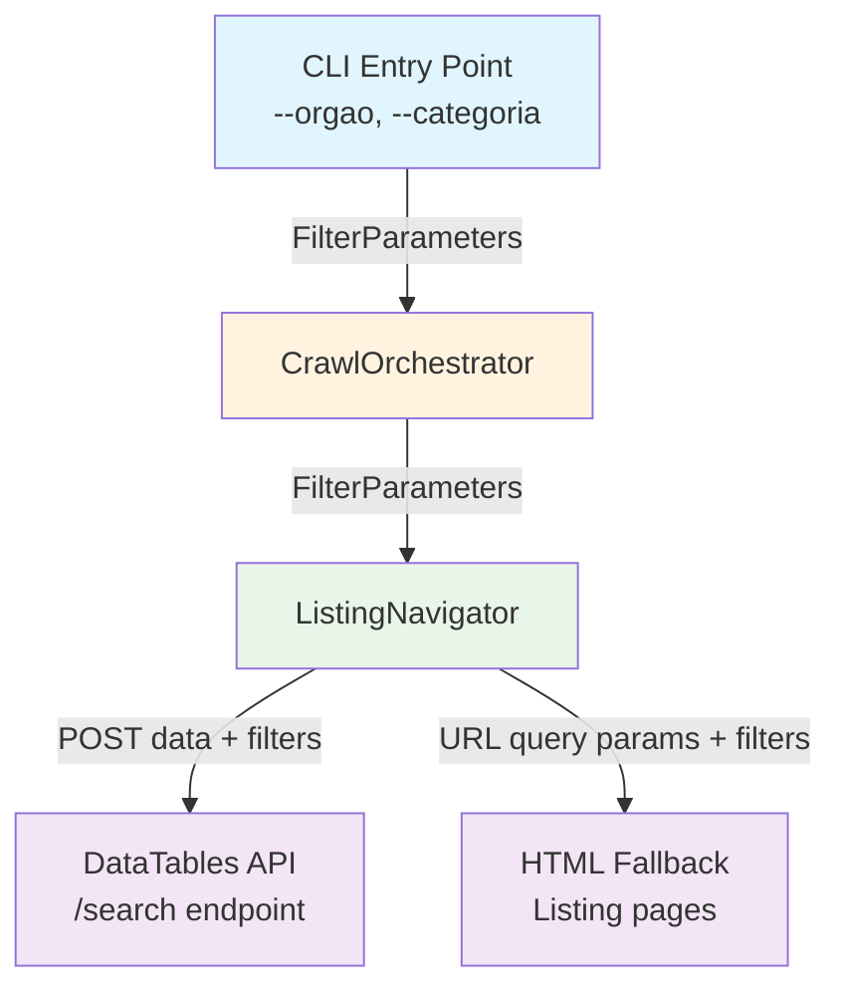

# Design Document

## Overview

This feature extends GovDataCrawler v1.0.0 with optional filtering capabilities for the contract listing scrape. Two new CLI arguments — `--orgao` (organ number) and `--categoria` (category) — allow users to restrict the crawl to contracts matching specific government organizations and/or contract categories. Filters are applied at the listing navigation level by including them as POST parameters in DataTables API requests (primary path) or as query parameters in HTML fallback URLs, reducing both network traffic and processing time.

### Key Design Decisions

1. **Filter at the API level, not post-fetch**: Filters are sent as parameters to the ComprasNet `/search` endpoint so the server returns only matching contracts. This avoids downloading and discarding irrelevant data, which is critical given the portal has hundreds of thousands of contracts.
2. **Optional, composable filters**: Both `--orgao` and `--categoria` are optional and independent. When both are provided, they apply AND logic (server-side). When neither is provided, behavior is identical to v1.0.0.
3. **Minimal surface area**: The change touches only three modules (`cli.py`, `listing.py`, `orchestrator.py`) and introduces a lightweight `FilterParameters` dataclass to carry filter state. No new modules are needed.
4. **Backward compatibility**: All existing CLI arguments, behavior, and output formats are preserved. The only additions are two new optional arguments and filter-aware logging.

### Technology Stack

No new dependencies are introduced. The feature uses the existing stack:

| Component | Technology | Usage in this feature |
|---|---|---|
| CLI | `argparse` (stdlib) | Two new optional arguments |
| HTTP | `requests` via `HttpClient` | Filter params added to POST data |
| Data carrier | `dataclasses` (stdlib) | New `FilterParameters` dataclass |
| Testing | `pytest` + `hypothesis` | Property-based tests for filter logic |

## Architecture

The filtering feature threads filter values from the CLI entry point through the orchestrator to the `ListingNavigator`, which applies them to every paginated request.



### Data Flow

1. **CLI** parses `--orgao` and `--categoria`, constructs a `FilterParameters` instance.
2. **CLI** passes `FilterParameters` to `ListingNavigator` during construction.
3. **ListingNavigator** stores the filters and injects them into every request:
   - **DataTables API path**: Merges filter key-value pairs into the POST `data` dict.
   - **HTML fallback path**: Appends filter key-value pairs as URL query parameters.
4. **CLI** logs active filters at startup. `SummaryReporter` includes them in the final summary.

### Modules Modified

| Module | Change |
|---|---|
| `gov_data_crawler/cli.py` | Add `--orgao` and `--categoria` arguments; construct `FilterParameters`; pass to `ListingNavigator`; log active filters |
| `gov_data_crawler/listing.py` | `ListingNavigator.__init__` accepts optional `FilterParameters`; `_collect_via_datatables_api` merges filters into POST data; `_collect_via_html_scraping` appends filters as query params |
| `gov_data_crawler/summary.py` | `CrawlSummary` gains an optional `filters` field; `SummaryReporter` accepts and logs filters |

## Components and Interfaces

### FilterParameters (New)

```python
# gov_data_crawler/listing.py

@dataclass(frozen=True)
class FilterParameters:
    """Immutable container for optional listing filters.

    Attributes:
        orgao: Government organ number to filter by, or None.
        categoria: Contract category to filter by, or None.
    """
    orgao: str | None = None
    categoria: str | None = None

    @property
    def has_filters(self) -> bool:
        """Return True if at least one filter is set."""
        return self.orgao is not None or self.categoria is not None

    def to_post_params(self) -> dict[str, str]:
        """Convert active filters to a dict suitable for POST data.

        Returns:
            Dict with only the non-None filter values.
        """
        params: dict[str, str] = {}
        if self.orgao is not None:
            params["orgao"] = self.orgao
        if self.categoria is not None:
            params["categoria"] = self.categoria
        return params

    def to_query_params(self) -> dict[str, str]:
        """Convert active filters to a dict suitable for URL query parameters.

        Returns:
            Dict with only the non-None filter values.
        """
        # Same representation for both POST and query params.
        return self.to_post_params()
```

### CLI Entry Point (Modified)

```python
# gov_data_crawler/cli.py  — additions only

def parse_args(argv: list[str] | None = None) -> argparse.Namespace:
    """Parse command-line arguments.

    New arguments added:
        --orgao: Filter contracts by government organ number (número do órgão)
        --categoria: Filter contracts by category (categoria)

    Returns:
        Parsed namespace now also includes: orgao, categoria.
    """
    # ... existing arguments ...

    parser.add_argument(
        "--orgao",
        type=str,
        default=None,
        help="Filter contracts by government organ number (número do órgão)",
    )
    parser.add_argument(
        "--categoria",
        type=str,
        default=None,
        help="Filter contracts by category (categoria)",
    )

    return parser.parse_args(argv)


def main(argv: list[str] | None = None) -> None:
    """Application entry point — modified to pass filters."""
    args = parse_args(argv)
    # ... existing setup ...

    filters = FilterParameters(orgao=args.orgao, categoria=args.categoria)

    # Log active filters (Requirement 5)
    if filters.has_filters:
        if filters.orgao is not None:
            logger.info("  Filter orgao: %s", filters.orgao)
        if filters.categoria is not None:
            logger.info("  Filter categoria: %s", filters.categoria)
    else:
        logger.info("  No filters active — all contracts will be collected")

    listing_navigator = ListingNavigator(
        http_client=http_client,
        parser=listing_parser,
        base_url=f"{BASE_URL}{LISTING_PATH}",
        logger=logger,
        filters=filters,  # NEW
    )

    # ... rest unchanged, except SummaryReporter receives filters ...
```

### ListingNavigator (Modified)

```python
# gov_data_crawler/listing.py  — changes to ListingNavigator

class ListingNavigator:
    """Navigates all pages of the contract listing via the DataTables API."""

    def __init__(
        self,
        http_client: HttpClient,
        parser: ListingParser,
        base_url: str,
        logger: logging.Logger,
        filters: FilterParameters | None = None,  # NEW
    ) -> None:
        """Initialize the listing navigator.

        Args:
            http_client: HTTP client for fetching pages.
            parser: Parser for extracting data from listing HTML / JSON.
            base_url: The starting URL for the contract listing.
            logger: Logger instance for progress messages.
            filters: Optional filter parameters to apply to every request.
        """
        self._http_client = http_client
        self._parser = parser
        self._base_url = base_url
        self._logger = logger
        self._filters = filters or FilterParameters()

    def _collect_via_datatables_api(
        self, csrf_token: str, max_ids: int | None = None
    ) -> list[str]:
        """Paginate through the DataTables /search endpoint.

        Filter parameters are merged into the POST data for every request.
        """
        # ... existing setup ...

        post_data = {
            "draw": str(draw),
            "start": str(start),
            "length": str(page_size),
        }
        # Merge filter parameters into POST data
        post_data.update(self._filters.to_post_params())

        # ... rest of pagination loop ...

    def _collect_via_html_scraping(
        self, initial_html: str, max_ids: int | None = None
    ) -> list[str]:
        """Legacy fallback: scrape contract IDs from rendered HTML pages.

        Filter parameters are appended as query parameters to the listing URL.
        """
        # Build the filtered base URL for subsequent pages
        # The initial page was already fetched without filters,
        # so we need to re-fetch if filters are active.
        # ... implementation details ...
```

### SummaryReporter (Modified)

```python
# gov_data_crawler/summary.py  — additions

@dataclass
class CrawlSummary:
    """Execution statistics for a crawl run."""
    # ... existing fields ...
    filters: dict[str, str] | None = None  # NEW: active filter params

class SummaryReporter:
    def __init__(self, logger: logging.Logger, filters: FilterParameters | None = None) -> None:
        # ... existing init ...
        self._filters = filters

    def finalize(self, stopped_by: str | None = None) -> CrawlSummary:
        # ... existing logic ...
        # Include filters in summary
        summary = CrawlSummary(
            # ... existing fields ...
            filters=self._filters.to_post_params() if self._filters and self._filters.has_filters else None,
        )
        if summary.filters:
            self._logger.info("  Filters: %s", summary.filters)
```

## Data Models

### FilterParameters

```python
@dataclass(frozen=True)
class FilterParameters:
    orgao: str | None = None
    categoria: str | None = None
```

**Invariants:**
- Immutable after construction (frozen dataclass)
- Both fields are optional and independent
- `has_filters` returns `True` iff at least one field is not None
- `to_post_params()` and `to_query_params()` return only non-None entries

### POST Data with Filters (DataTables API)

When filters are active, the POST body to `/transparencia/contratos/search` includes the filter keys alongside the standard DataTables pagination parameters:

```
draw=1&start=0&length=25&orgao=26000&categoria=05
```

When no filters are active, the POST body is identical to v1.0.0:

```
draw=1&start=0&length=25
```

### HTML Fallback URL with Filters

When filters are active and the HTML fallback path is used, the listing URL includes query parameters:

```
https://contratos.comprasnet.gov.br/transparencia/contratos?orgao=26000&categoria=05
```

### CrawlSummary (Extended)

```python
@dataclass
class CrawlSummary:
    total_contracts: int
    successful: int
    failed: int
    skipped: int
    attachments_downloaded: int
    start_time: str
    end_time: str
    duration_seconds: float
    stopped_by: str | None = None
    filters: dict[str, str] | None = None  # NEW
```

### CLI Arguments (Extended)

| Parameter | Default | CLI Flag | Description |
|---|---|---|---|
| Organ number | `None` | `--orgao` | Filter contracts by government organ number (número do órgão) |
| Category | `None` | `--categoria` | Filter contracts by category (categoria) |


## Correctness Properties

*A property is a characteristic or behavior that should hold true across all valid executions of a system — essentially, a formal statement about what the system should do. Properties serve as the bridge between human-readable specifications and machine-verifiable correctness guarantees.*

### Property 1: CLI argument round-trip preserves filter values

*For any* pair of optional string values (orgao, categoria), when passed as `--orgao` and/or `--categoria` arguments to `parse_args`, the returned namespace SHALL contain the exact same values in `args.orgao` and `args.categoria` respectively. When an argument is omitted, its value SHALL be `None`.

**Validates: Requirements 1.1, 1.2, 1.3, 2.1, 2.2, 2.3**

### Property 2: FilterParameters serialization includes exactly the non-None filters

*For any* `FilterParameters` instance constructed with arbitrary optional orgao and categoria values, `to_post_params()` SHALL return a dict containing exactly the entries whose values are not None — with key `"orgao"` mapped to the orgao value when set, and key `"categoria"` mapped to the categoria value when set. The same SHALL hold for `to_query_params()`. When both values are None, both methods SHALL return an empty dict.

**Validates: Requirements 3.1, 3.2, 3.3, 3.4, 4.1, 4.2**

### Property 3: FilterParameters has_filters is consistent with field presence

*For any* `FilterParameters` instance, `has_filters` SHALL return `True` if and only if at least one of `orgao` or `categoria` is not None.

**Validates: Requirements 3.4, 4.2, 5.1, 5.2**

### Property 4: CrawlSummary includes active filters

*For any* set of filter values (including no filters), when a `SummaryReporter` is constructed with those filters and `finalize()` is called, the resulting `CrawlSummary.filters` field SHALL equal the dict returned by `FilterParameters.to_post_params()` when filters are active, or `None` when no filters are active.

**Validates: Requirements 5.3**

## Error Handling

### Filter-Specific Error Scenarios

| Error Type | Component | Strategy |
|---|---|---|
| Invalid `--orgao` or `--categoria` value | CLI / ComprasNet Portal | The CLI accepts any string value. If the portal does not recognize the filter value, it returns zero results — this is not an error condition. The crawler logs the filter values at startup so the user can verify correctness. |
| Filters ignored by portal | ListingNavigator | If the portal ignores unknown POST parameters, the crawl proceeds as if no filters were applied. The user can detect this by comparing the number of collected contracts against expectations. |
| CSRF token unavailable with filters | ListingNavigator | Falls back to HTML scraping with query parameters, same as v1.0.0 behavior. Filters are appended as query params to the fallback URL. |

### No New Exception Types

This feature does not introduce new exception types. All error handling follows the existing patterns:
- HTTP errors are handled by `HttpClient` retry logic
- Parsing errors are caught by `ContractProcessor`
- The filter parameters are simple strings that require no validation beyond what `argparse` provides

## Testing Strategy

### Dual Testing Approach

The project uses both unit tests and property-based tests for comprehensive coverage.

**Unit Tests** (`pytest`):
- CLI argument parsing with `--orgao` and `--categoria` in various combinations
- Help text verification for both new arguments
- Default value (None) when arguments are omitted
- Integration test: `ListingNavigator` sends correct POST data with filters (mocked HTTP)
- Integration test: `ListingNavigator` constructs correct fallback URLs with query params (mocked HTTP)
- Logging verification: active filters logged at startup, no-filter message logged when absent
- Summary output includes filter information

**Property-Based Tests** (`hypothesis`):
- Universal properties that hold across all valid filter inputs
- Minimum 100 iterations per property test
- Each property test references its design document property
- Tag format: **Feature: crawl-filtering, Property {number}: {property_text}**

### Test Organization

```
tests/
├── unit/
│   ├── test_cli.py                    # Extended: --orgao, --categoria parsing
│   └── test_listing_navigator.py      # Extended: filter propagation (mocked HTTP)
├── property/
│   ├── test_cli_filter_args_props.py  # Property 1: CLI argument round-trip
│   ├── test_filter_params_props.py    # Property 2 & 3: FilterParameters serialization and has_filters
│   └── test_summary_filters_props.py  # Property 4: CrawlSummary includes filters
└── integration/
    └── test_filter_propagation.py     # End-to-end: filters flow from CLI to API requests
```

### Property-Based Testing Configuration

- **Library**: `hypothesis` 6.x (already in dev dependencies)
- **Minimum iterations**: 100 per property (configured via `@settings(max_examples=100)`)
- **Deadline**: 1000ms per example
- **Database**: Hypothesis example database enabled for reproducibility
