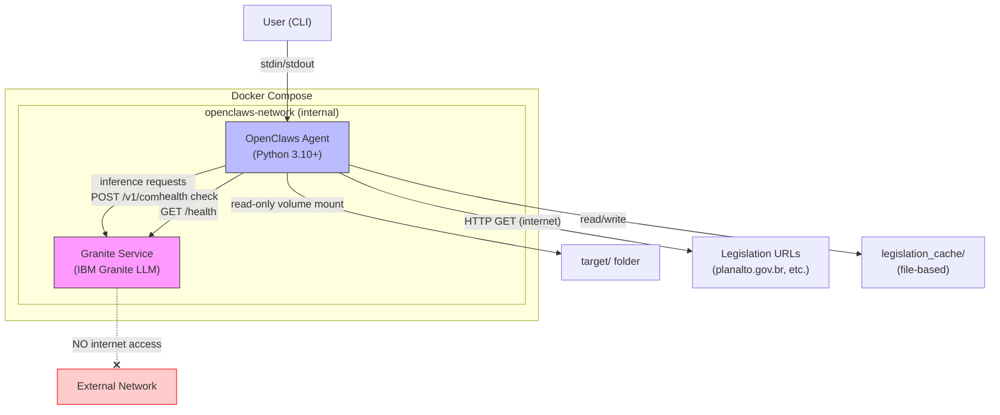
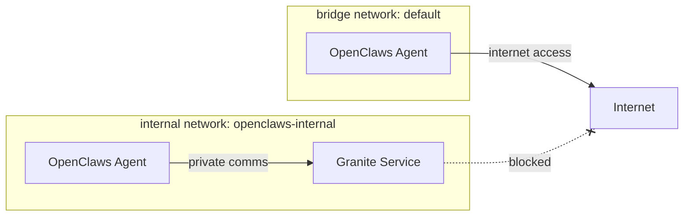
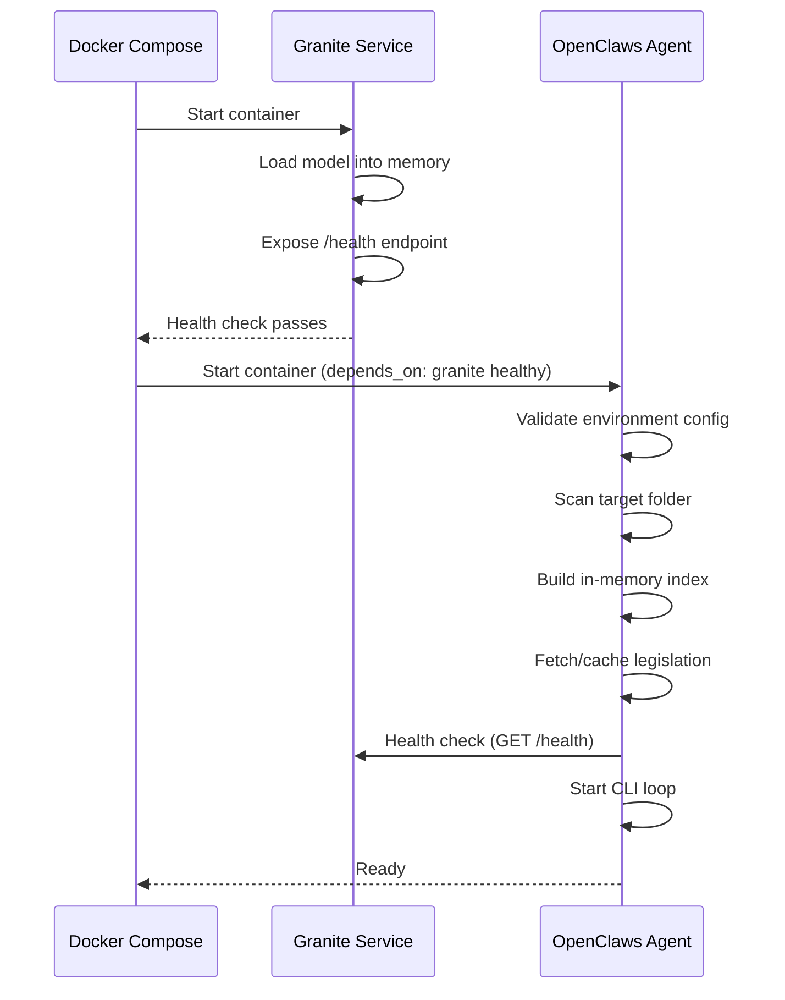
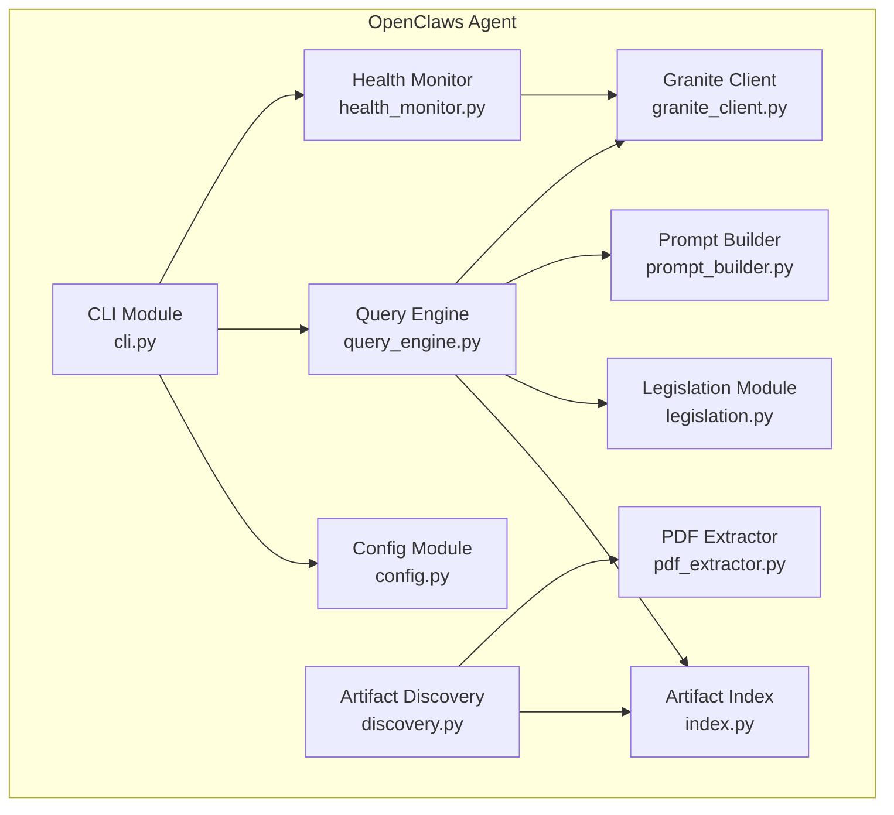
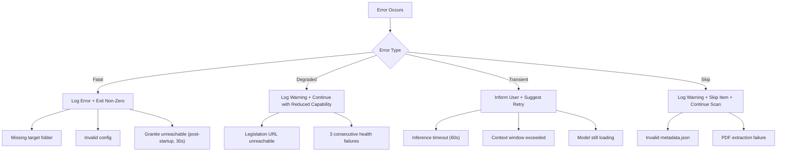

# Design Document: OpenClaws AI Assistant

## Overview

OpenClaws is a containerized AI assistant that analyzes Brazilian government contract artifacts collected by GovDataCrawler. It runs as a two-container system orchestrated via Docker Compose:

1. **OpenClaws Agent** — A Python CLI application that discovers contract artifacts in the `target` folder, fetches and caches Brazilian procurement legislation, processes user queries, and delegates inference to the Granite Service.
2. **Granite Service** — An isolated IBM Granite LLM container with no internet access that processes inference requests exclusively from the OpenClaws Agent over a private network.

The system enables users to ask natural language questions about downloaded contracts and receive answers grounded in artifact data and Brazilian procurement legislation.

### Key Design Decisions

| Decision | Rationale |
|---|---|
| Two-container architecture with network isolation | Granite LLM has no internet access for security; Agent has internet for legislation fetching |
| In-memory index for artifact search | Fast query matching without external database dependency |
| File-based legislation cache | Survives container restarts; reduces startup time on subsequent runs |
| CLI interface (not HTTP API) | Matches existing project pattern as a CLI tool |
| Hypothesis for property-based testing | Already used in the project (v6.122.3) |

## Architecture

### System Architecture Diagram



### Network Architecture



The OpenClaws Agent is attached to two networks:
- **default** (bridge): provides internet access for legislation fetching
- **openclaws-internal** (internal: true): private communication with Granite Service

The Granite Service is attached only to `openclaws-internal`, which has `internal: true` set, preventing any route to external hosts.

### Container Startup Sequence



## Components and Interfaces

### Component Diagram



### Module Responsibilities

| Module | Responsibility |
|---|---|
| `cli.py` | User interaction loop, input validation, progress display |
| `config.py` | Environment variable parsing, validation, defaults |
| `discovery.py` | Recursive target folder scan, artifact identification |
| `index.py` | In-memory artifact storage, text search matching |
| `legislation.py` | URL fetching, HTML text extraction, file-based caching |
| `query_engine.py` | Orchestrates query processing pipeline |
| `prompt_builder.py` | Constructs LLM prompts from artifacts + legislation + query |
| `granite_client.py` | HTTP client for Granite Service inference API |
| `health_monitor.py` | Periodic health checking, failure counting |
| `pdf_extractor.py` | PDF text extraction (up to 50 MB per file) |

### Interface Definitions

#### Granite Service API (OpenAPI-compatible)

**POST /v1/completions**
```json
{
  "prompt": "string",
  "temperature": 0.7,
  "max_tokens": 1024,
  "top_p": 0.9
}
```

Response:
```json
{
  "text": "string",
  "usage": {
    "prompt_tokens": 0,
    "completion_tokens": 0
  }
}
```

Error responses:
- `400` — Invalid parameter or context window exceeded
- `503` — Model still loading

**GET /health**
```json
{
  "status": "healthy" | "unhealthy",
  "model_loaded": true | false
}
```

#### GraniteClient Interface

```python
class GraniteClient:
    def __init__(self, endpoint_url: str, timeout: int = 60) -> None: ...

    def generate(
        self,
        prompt: str,
        temperature: float = 0.7,
        max_tokens: int = 1024,
        top_p: float = 0.9,
    ) -> GenerationResult: ...

    def health_check(self, timeout: int = 5) -> HealthStatus: ...
```

#### ArtifactIndex Interface

```python
class ArtifactIndex:
    def add_artifact(self, artifact: IndexedArtifact) -> None: ...

    def search(self, query: str, max_results: int = 20) -> list[SearchResult]: ...

    def artifact_count(self) -> int: ...

    def pdf_count(self) -> int: ...
```

#### QueryEngine Interface

```python
class QueryEngine:
    def __init__(
        self,
        index: ArtifactIndex,
        legislation: LegislationCache,
        granite_client: GraniteClient,
        prompt_builder: PromptBuilder,
    ) -> None: ...

    def process_query(self, user_query: str) -> QueryResponse: ...
```

#### LegislationCache Interface

```python
class LegislationCache:
    def __init__(self, cache_dir: str, timeout: int = 30) -> None: ...

    def fetch_and_cache(self, urls: list[str]) -> FetchReport: ...

    def get_relevant_content(self, topic: str) -> list[LegislationSnippet]: ...
```

#### Config Interface

```python
@dataclass
class AgentConfig:
    target_folder: str = "./target"
    granite_endpoint: str = "http://granite:8080"
    health_check_interval: int = 30
    log_level: str = "INFO"

    @classmethod
    def from_env(cls) -> "AgentConfig": ...

@dataclass
class GraniteConfig:
    model_name: str = "ibm-granite/granite-3.1-8b-instruct"
    inference_port: int = 8080
    max_context_length: int = 4096
    temperature: float = 0.7
    max_tokens: int = 2048
    top_p: float = 0.95

    @classmethod
    def from_env(cls) -> "GraniteConfig": ...
```

## Data Models

### Core Data Classes

```python
from dataclasses import dataclass, field
from enum import Enum


@dataclass
class IndexedArtifact:
    """An artifact loaded into the in-memory index."""
    contract_id: str
    orgao: str
    unidade_gestora: str
    contract_number: str
    supplier_name: str
    contract_value: str
    start_date: str
    end_date: str
    object_description: str
    extra_fields: dict[str, str]
    attachments: list[str]
    scraped_at: str
    folder_path: str
    pdf_texts: dict[str, str]  # filename -> extracted text


@dataclass
class SearchResult:
    """A single search match from the artifact index."""
    artifact: IndexedArtifact
    relevance_score: float
    matched_fields: list[str]


@dataclass
class LegislationSnippet:
    """A relevant excerpt from cached legislation."""
    source_url: str
    law_name: str
    content: str


@dataclass
class GenerationResult:
    """Response from the Granite Service."""
    text: str
    prompt_tokens: int
    completion_tokens: int


class HealthStatus(Enum):
    HEALTHY = "healthy"
    UNHEALTHY = "unhealthy"
    UNREACHABLE = "unreachable"


@dataclass
class QueryResponse:
    """Complete response to a user query."""
    answer: str
    referenced_contracts: list[str]  # contract_ids
    legislation_citations: list[str]
    confidence_labels: dict[str, str]  # claim -> "based on data" | "undetermined"


@dataclass
class FetchReport:
    """Report of legislation fetch operation."""
    successful_urls: list[str]
    failed_urls: list[str]
    cached_urls: list[str]  # served from cache


@dataclass
class AgentConfig:
    """OpenClaws Agent configuration from environment variables."""
    target_folder: str = "./target"
    granite_endpoint: str = "http://granite:8080"
    health_check_interval: int = 30  # seconds
    log_level: str = "INFO"

    @classmethod
    def from_env(cls) -> "AgentConfig":
        """Parse and validate configuration from environment variables."""
        ...


@dataclass
class GraniteConfig:
    """Granite Service configuration from environment variables."""
    model_name: str = "ibm-granite/granite-3.1-8b-instruct"
    inference_port: int = 8080
    max_context_length: int = 4096
    temperature: float = 0.7
    max_tokens: int = 2048
    top_p: float = 0.95

    @classmethod
    def from_env(cls) -> "GraniteConfig":
        """Parse and validate configuration from environment variables."""
        ...
```

### Docker Compose Configuration Model

```yaml
# docker-compose.yml
version: "3.9"

services:
  granite:
    image: "ibm-granite/granite-3.1-8b-instruct:latest"
    container_name: openclaws-granite
    networks:
      - openclaws-internal
    environment:
      - GRANITE_MODEL_NAME=${GRANITE_MODEL_NAME:-ibm-granite/granite-3.1-8b-instruct}
      - GRANITE_INFERENCE_PORT=${GRANITE_INFERENCE_PORT:-8080}
      - GRANITE_MAX_CONTEXT_LENGTH=${GRANITE_MAX_CONTEXT_LENGTH:-4096}
      - GRANITE_TEMPERATURE=${GRANITE_TEMPERATURE:-0.7}
      - GRANITE_MAX_TOKENS=${GRANITE_MAX_TOKENS:-2048}
      - GRANITE_TOP_P=${GRANITE_TOP_P:-0.95}
    healthcheck:
      test: ["CMD", "curl", "-f", "http://localhost:8080/health"]
      interval: 30s
      timeout: 5s
      retries: 3
      start_period: 120s
    deploy:
      resources:
        reservations:
          devices:
            - driver: nvidia
              count: all
              capabilities: [gpu]

  openclaws:
    build:
      context: .
      dockerfile: openclaws/Dockerfile
    container_name: openclaws-agent
    depends_on:
      granite:
        condition: service_healthy
    networks:
      - default
      - openclaws-internal
    volumes:
      - ./target:/app/target:ro
      - openclaws-cache:/app/legislation_cache
    environment:
      - OPENCLAWS_TARGET_FOLDER=${OPENCLAWS_TARGET_FOLDER:-/app/target}
      - OPENCLAWS_GRANITE_ENDPOINT=${OPENCLAWS_GRANITE_ENDPOINT:-http://granite:8080}
      - OPENCLAWS_HEALTH_CHECK_INTERVAL=${OPENCLAWS_HEALTH_CHECK_INTERVAL:-30}
      - OPENCLAWS_LOG_LEVEL=${OPENCLAWS_LOG_LEVEL:-INFO}
    stdin_open: true
    tty: true
    healthcheck:
      test: ["CMD", "python", "-c", "import sys; sys.exit(0)"]
      interval: 30s
      timeout: 5s
      retries: 3
      start_period: 30s

networks:
  openclaws-internal:
    internal: true

volumes:
  openclaws-cache:
```

### Folder Structure

```
GovDataCrawler/
├── openclaws/
│   ├── __init__.py
│   ├── __main__.py
│   ├── cli.py
│   ├── config.py
│   ├── discovery.py
│   ├── index.py
│   ├── legislation.py
│   ├── query_engine.py
│   ├── prompt_builder.py
│   ├── granite_client.py
│   ├── health_monitor.py
│   ├── pdf_extractor.py
│   └── Dockerfile
├── docker-compose.yml
├── tests/
│   ├── property/
│   │   ├── test_openclaws_config_props.py
│   │   ├── test_openclaws_index_props.py
│   │   ├── test_openclaws_discovery_props.py
│   │   └── test_openclaws_query_props.py
│   └── unit/
│       └── test_openclaws_*.py
└── ...
```

## Correctness Properties

*A property is a characteristic or behavior that should hold true across all valid executions of a system — essentially, a formal statement about what the system should do. Properties serve as the bridge between human-readable specifications and machine-verifiable correctness guarantees.*

### Property 1: Agent configuration validation round-trip

*For any* set of environment variable values for the OpenClaws Agent (target folder path ≤ 4096 chars, granite endpoint ≤ 2048 chars, health check interval as integer 5–300, log level as one of DEBUG/INFO/WARN/ERROR), parsing the environment SHALL produce an AgentConfig with those exact values; and *for any* value outside the valid ranges or of incompatible type, parsing SHALL raise a validation error whose message contains the variable name, the invalid value, and the expected format.

**Validates: Requirements 8.1, 8.5, 7.2**

### Property 2: Granite configuration validation round-trip

*For any* set of environment variable values for the Granite Service (model name ≤ 256 chars, inference port 1–65535, max context length 512–131072, temperature 0.0–2.0, max tokens 1–8192, top-p 0.0–1.0), parsing the environment SHALL produce a GraniteConfig with those exact values; and *for any* value outside the valid ranges or of incompatible type, parsing SHALL raise a validation error whose message contains the variable name, the invalid value, and the expected format.

**Validates: Requirements 8.2, 8.6, 2.4**

### Property 3: Artifact discovery identifies exactly folders containing metadata.json

*For any* directory tree under the target folder, the discovery module SHALL return exactly the set of folders that contain a file named `metadata.json`, and no others.

**Validates: Requirements 3.1**

### Property 4: Metadata indexing preserves all fields

*For any* valid ContractMetadata instance serialized to a `metadata.json` file, after discovery and indexing, the corresponding IndexedArtifact in the in-memory index SHALL contain values equal to the original for all schema fields (contract_id, orgao, unidade_gestora, contract_number, supplier_name, contract_value, start_date, end_date, object_description, extra_fields, attachments, scraped_at).

**Validates: Requirements 3.2**

### Property 5: Query input validation accepts valid lengths and rejects invalid

*For any* string, the CLI input validator SHALL accept it if and only if its stripped length is between 1 and 2000 characters (inclusive). Empty strings, whitespace-only strings, and strings exceeding 2000 characters SHALL be rejected with an error message indicating the allowed query length.

**Validates: Requirements 5.1, 5.2**

### Property 6: Search returns only artifacts containing query terms

*For any* non-empty query string and any artifact index, every artifact in the search results SHALL contain at least one of the query terms in one of the searchable fields (contract_id, contract_number, supplier_name, object_description, or extracted PDF text).

**Validates: Requirements 5.3**

### Property 7: Prompt construction includes all required components

*For any* user query, matched artifact list (non-empty), and legislation context, the constructed prompt SHALL contain: (a) the user query text, (b) data from each matched artifact including its folder path and metadata fields, and (c) at least one legislation snippet with citation instructions.

**Validates: Requirements 5.4, 6.1**

### Property 8: Search results are capped at 20

*For any* artifact index and any query, the search method SHALL return at most 20 results regardless of how many artifacts match.

**Validates: Requirements 6.4**

### Property 9: Truncation notice when results exceed limit

*For any* query that matches more than 20 artifacts in the index, the query response SHALL include a notice informing the user that results are limited to the first 20 matches and suggesting query refinement.

**Validates: Requirements 6.6**

### Property 10: Health monitor detects consecutive failures

*For any* sequence of health check results, the health monitor SHALL log an error-level message if and only if the sequence contains 3 or more consecutive failures (unhealthy or unreachable). Sequences with fewer than 3 consecutive failures SHALL not trigger the error log.

**Validates: Requirements 7.5**

## Error Handling

### Error Categories and Strategies

| Error Category | Source | Strategy | User Impact |
|---|---|---|---|
| Configuration errors | Invalid env vars | Log error with details, exit non-zero | Startup failure with clear message |
| Target folder missing | Filesystem | Log error, exit non-zero | Startup failure |
| Invalid metadata JSON | Filesystem | Log warning, skip artifact | Degraded index (partial data) |
| PDF extraction failure | Filesystem/library | Log warning, continue | Missing PDF text for that artifact |
| Legislation fetch timeout | Network | Log warning, use cache or degrade | Reduced legislation context |
| Granite unreachable at startup | Network | Blocked by Docker depends_on | Agent won't start |
| Granite unreachable after startup | Network | Log error, exit within 30s | Service termination |
| Granite inference timeout (60s) | Network | Inform user, suggest retry | Query fails gracefully |
| Granite context exceeded | API response | Inform user, suggest shorter query | Query fails gracefully |
| Granite model loading (503) | API response | Inform user, suggest retry | Temporary unavailability |
| Health check failure (3x) | Network | Log error, mark degraded | Degraded service warning |

### Error Propagation Flow



### Retry and Circuit Breaker Policies

| Operation | Timeout | Retries | Backoff |
|---|---|---|---|
| Legislation URL fetch | 30s per URL | 0 (fail fast, use cache) | N/A |
| Granite inference | 60s | 0 (user-initiated retry) | N/A |
| Granite health check | 5s | 3 consecutive before error | Fixed interval (configurable) |

## Testing Strategy

### Dual Testing Approach

This feature uses both **unit tests** (example-based) and **property-based tests** (Hypothesis) for comprehensive coverage.

**Property-based testing** is appropriate for this feature because:
- Configuration validation has clear input/output behavior with large input spaces (strings, numbers, floats)
- Artifact discovery and indexing are pure data transformations
- Search and query processing have universal properties that hold across all valid inputs
- The project already uses Hypothesis (v6.122.3) with established patterns

### Property-Based Testing Configuration

- **Library**: Hypothesis 6.122.3 (already in project dev dependencies)
- **Minimum iterations**: 100 per property (`@settings(max_examples=100)`)
- **Tag format**: `Feature: openclaws-ai-assistant, Property {N}: {title}`
- **Test location**: `tests/property/test_openclaws_*.py`

### Test Distribution

| Property | Test File | What It Validates |
|---|---|---|
| Property 1 (Agent config) | `test_openclaws_config_props.py` | Env var parsing + validation |
| Property 2 (Granite config) | `test_openclaws_config_props.py` | Env var parsing + validation |
| Property 3 (Discovery) | `test_openclaws_discovery_props.py` | Folder scanning correctness |
| Property 4 (Indexing round-trip) | `test_openclaws_index_props.py` | Metadata preservation |
| Property 5 (Query validation) | `test_openclaws_query_props.py` | Input length validation |
| Property 6 (Search correctness) | `test_openclaws_query_props.py` | Result relevance |
| Property 7 (Prompt completeness) | `test_openclaws_query_props.py` | Prompt construction |
| Property 8 (Result cap) | `test_openclaws_query_props.py` | Max 20 results |
| Property 9 (Truncation notice) | `test_openclaws_query_props.py` | User notification |
| Property 10 (Health monitor) | `test_openclaws_health_props.py` | Consecutive failure detection |

### Unit Tests (Example-Based)

| Area | Test File | Coverage |
|---|---|---|
| CLI interaction | `test_openclaws_cli.py` | Progress indicator, response display, error messages |
| Granite client | `test_openclaws_granite_client.py` | Timeout handling, 503 response, error parsing |
| Legislation cache | `test_openclaws_legislation.py` | Cache hit/miss, degraded startup, URL list |
| Discovery edge cases | `test_openclaws_discovery.py` | Missing folder, empty folder, invalid JSON skip |
| Health monitor | `test_openclaws_health_monitor.py` | Warning on unhealthy, interval scheduling |
| Config defaults | `test_openclaws_config.py` | Default values when env vars unset |

### Integration Tests

| Scenario | What It Validates |
|---|---|
| Docker Compose up | Both containers start, network isolation works |
| End-to-end query | User query → search → prompt → inference → response |
| Granite unavailable | Agent detects failure and exits within 30s |

### Test Dependencies (additions to pyproject.toml)

```toml
[project.optional-dependencies]
dev = [
    # ... existing deps ...
    "PyPDF2>=3.0.0",  # for PDF text extraction in tests
]
```

